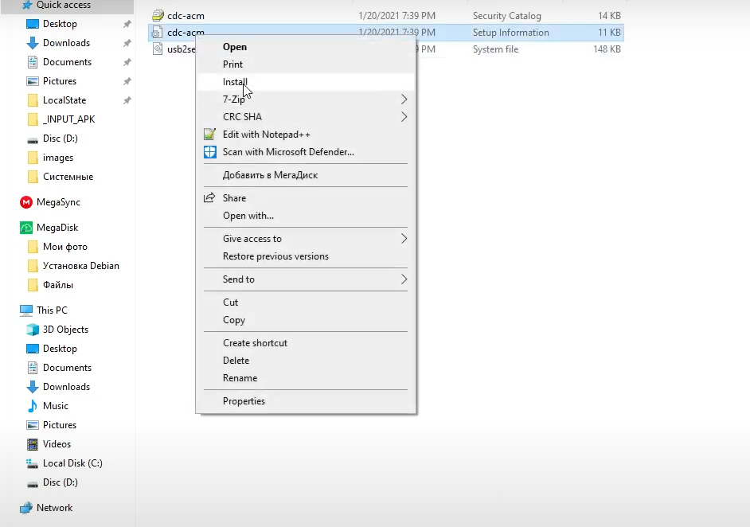

Halo semuanya! Jadi setelah bypass perlindungan DAA dan SLA mediatek baru dirilis, bisa di cek di repo [github di sini](http://github.com/MTK-bypass), dengan bypass ini, kita bisa menggunakannya di SPFlash, berikut adalah panduan bagaimana Anda dapat melakukannya! Panduan ini hanya untuk RMX2001, RMX2002 dan RMX2003 (REALME G90T Series). JANGAN COBA LAKUKAN DI PERANGKAT LAIN!<br/>

CEK "TROUBLESHOOTING" DI AKHIR TUTORIAL TERLEBIH DAHULU JIKA ANDA MEMILIKI MASALAH DALAM PROSES SEBELUM BERTANYA!<br/>

>SELALU GUNAKAN DOWNLOAD MODE DI SP FLASH TOOL!
>JANGAN SENTUH APA PUN YANG TERKAIT DENGAN FORMAT DI SP FLASH TOOL!
>>(ANDA AKAN KEHILANGAN IMEI JIKA MENGGUNAKAN FORMAT ALL + DOWNLOAD. ANDA AMAN JIKA MENGGUNAKAN DOWNLOAD SAJA!)
```

### VIDEO GUIDES:
<iframe width="100%" height="315" src="https://www.youtube.com/embed/yxs3SCYSKb0" title="YouTube video player" frameborder="0" allow="accelerometer; autoplay; clipboard-write; encrypted-media; gyroscope; picture-in-picture" allowfullscreen></iframe><br/>

[JIKA MENGGUNAKAN LINUX KLIK DI SINI](https://forum.xda-developers.com/t/guide-unbrick-downgrade-your-realme-6-6i-india-6s-linux-method.4251077/#post-84705057) - Kredit ke [@bx2_nero](https://forum.xda-developers.com/m/6618455/)

### Metode Windows<br/>
Persyaratan:<br/>
- [Bypass Tools Pack](https://drive.google.com/file/d/1DFMUgpD5rWpSeI_qDZD-uhBxqhuvXvlB/view?usp=sharing) - (ALAT SPFLASH, DRIVER DAN BYPASS FILES)

### File OFP (OPPO FIRMWARE PACKAGE) yang didekripsi:<br/>

1) FIRMWARE LENGKAP - TERMASUK PARTISI "USERDATA", JADI UKURAN FILE LEBIH BESAR.
- A.50[EU] - [Link Broken]
- A.42[EU] - [Link Broken]
- Bagi yang punya mirror file ini (A.42-EU & A.50-EU), chat ke telegram @officialputuid * <br/>

- B.23 (rUI 1.0 rilis pertama) - [Mega](https://mega.nz/folder/aENFzagK#V8UqxdVZLNLjpIWHMjXAkA) - [GDrive](https://drive.google.com/file/d/1u5HYznX3iXFoowXKnGSIQ3k6hMpJN7il/view?usp=sharing) - [Mirror](https://samarv121.priv.workers.dev/0:/20210123-30646/B23e.zip)
- B.37 - [Mega](https://mega.nz/folder/nJ82za5S#GOeDTQT8PMKFobyZ3fDBPQ) - [GDrive](https://drive.google.com/uc?id=1O5-DaYk--JrFJwS0SuNkwLeDlw8t1jtK&export=download)
- B.53 - [Mega](https://mega.nz/folder/2YlCyCTR#kzUmFVZjkBqLNu572AaA3g) - [GDrive](https://drive.google.com/uc?id=1g7Z6zmnQLObdJq5KMI4wUA0OYcTdHU5z&export=download)

- C.16-IN [GDrive](https://drive.google.com/file/d/1hnOa8Sv-Kstt18qo06va3_rANW-RmALx/view) "rUI2.0 (A11)"

2) FIRMWARE NOU (NO USERDATA) - UNTUK ORANG DENGAN PAKET DATA/KOUTA TERBATAS.
- A.50[EU] - [Link Broken]
- A.42[EU] - [Link Broken]
- Bagi yang punya mirror file ini (A.42-EU & A.50-EU), chat ke telegram @officialputuid * <br/>

- B.23 - [GDrive](https://samarv121.priv.workers.dev/0:/20210225-31591/No-Userdata-B23e.zip) - [Mirror](https://samarv121.priv.workers.dev/0:/20210225-15809/No-Userdata-B23e.zip)
- B.37 - [GDrive](https://samarv121.priv.workers.dev/0:/20210225-24427/No-Userdata-B37e.zip) - [Mirror](https://samarv121.priv.workers.dev/0:/20210225-15651/No-Userdata-B37e.zip)
- B.53 - [GDrive](https://samarv121.priv.workers.dev/0:/20210225-5663/No-Userdata-B53e.zip) - [Mirror](https://samarv121.priv.workers.dev/0:/20210225-32760/No-Userdata-B53e.zip)

Silahkan baca penjelasan tentang apa itu partisi userdata dan apa bedanya dengan firmware lain disini. [APA ITU NOU-NO USERDATA](https://telegra.ph/Userdata---NO-Userdata-whats-the-difference-02-25)<br/>
Catatan: Semua file dengan tautan yang tersedia di atas diuji.<br/><br/>
[Python](https://www.python.org/downloads/) (Harus ditambahkan ke PATH saat instalasi, lihat tangkapan layar jika Anda tidak mengerti)<br/><br/>


Pastikan untuk memilih opsi terakhir.<br/><br/>
1) Buka command prompt lalu ketik:<br/>
python -m pip install pyusb pyserial json5


Setelah instalasi, Anda dapat menjalankan kembali perintah tersebut. Jika terlihat seperti screenshot di atas Anda siap untuk melanjutkan ke langkah berikutnya.

setelah instalasi selelsai tutup CMD.<br/><br/>
2) Buka folder driver, cari file .inf klik kanan dan tekan install.



3) [Unduh file ini](https://sourceforge.net/projects/libusb-win32/files/libusb-win32-releases/1.2.6.0/libusb-win32-devel-filter-1.2.6.0.exe/download) dan instal, setelah menginstal hubungkan ponsel Anda ke PC dengan menghubungkan ponsel Anda ke PC sambil melakukan Vol+- . Jika perangkat tidak terdeteksi, Install [driver ini](http://www.mediafire.com/file/nninaiiqy1e5csa/New_QcomMtk_Driver_Setup_V2.0.1.1_GsmMafia.Com.exe/file)


Tekan berikutnya, sambungkan perangkat Anda ke PC sambil menahan tombol Vol + - (perangkat Anda harus dimatikan) dan Anda akan melihat mtkdriver di bawah. Instal.


Pilih Port USB MediaTek dan instal.<br/><br/>
4) Matikan ponsel Anda dan sambungkan lagi ke PC sambil menahan tombol Vol + - lalu jalankan brom.bat di bawah folder Bypass. Jika tertulis "Perlindungan Dinonaktifkan" pada akhirnya Anda siap untuk melanjutkan. (Jika sudah seperti screenshot di bawah ini lanjutkan.)


Jika Anda memiliki masalah di sini, silakan periksa akhir panduan untuk memperbaikinya.<br/><br/>
5) Masuk ke folder Flash Tool dan buka SPFlash tool, setelah itu pilih scatter file dan juga jika tidak di set, atur download -agent. Anda tidak perlu memilih file auth karena otorisasi dinonaktifkan. Setelah Anda melakukannya, itu akan terlihat seperti ini.

>PASTIKAN HANYA 'DOWNLOAD MODE' YANG DIPILIH! JANGAN PILIH MODE LAIN!


Klik pilih Agen DA -> Folder "Bypass Tools Pack" -> "VerifiedBootFix" > Pilih file "DA_6765_6785_6768_6873_6885_6853.bin". 

Jika muncul error, masuk ke menu Opsi dan nonaktifkan opsi yang ditunjukkan di bawah ini. Anda akan dapat memilih file DA.
 


Pastikan "Unduh Saja (Download only)" dipilih. Jangan pilih FORMAT ataupun itu. Anda akan kehilangan IMEI, Serial Number/HW, dll. Jika Anda memilih "Format data + Download" pastikan Anda memilih "Unduh Saja (Download only)". 


Setelah di flash akan terlihat seperti ini. Unduhan telah selesai!<br/>

Sekarang, Anda dapat mulai dan lalu tunggu prosesnya, hingga tanda centang muncul. Anda dapat me-reboot ponsel Anda dan menggunakannya seperti sebelumnya! Semua data pengguna Anda (pasti) terhapus!

---

### Spoiler: PEMECAHAN MASALAH - FAQ DAN PERBAIKAN<br/><br/>
**KEMUNGKINAN KESALAHAN: "Boot terverifikasi diaktifkan." **


### Ada 2 perbaikan untuk ini.<br/><br/>
**Metode 1 (PERBAIKI LANGSUNG):**


Klik pilih Agen DA -> Folder "Bypass Tools Pack" -> "VerifiedBootFix" > Pilih file "DA_6765_6785_6768_6873_6885_6853.bin". 

Jika kesalahannya masuk ke menu Opsi dan nonaktifkan opsi yang ditunjukkan di bawah ini. Anda akan dapat memilih file DA. 


**Metode ke-2 (SOLUSI):**<br/>
Jika Anda mendapatkan kesalahan ini, dan Anda PASTI menggunakan mode "Hanya Unduh", ada cara untuk menghilangkannya. Pertama, muat pencar lalu hapus centang/batalkan pilihan partisi yang tercantum di bawah ini.

opporserve2,<br/>
cdt_engineering,<br/>
saya_kustom,<br/>
khusus_pramuat,<br/>
data pengguna,<br/>
super,<br/>

Setelah menjalankan brom.bat dan mem-flash semua partisi kecuali yang tercantum di atas, ponsel Anda akan dapat melakukan boot ulang ke pemulihan stok. Sekarang pilih opsi "Matikan" lalu jalankan **brom.bat**, lewati otorisasi dan kemudian flash partisi yang tercantum di bawah ini dari Alat SPFlash.

super,<br/>
dtbo,<br/>
data pengguna<br/>

Perangkat Anda akan dapat boot ke sistem setelah ini jika Anda telah mengikuti langkah-langkah dengan benar.<br/>

**KEMUNGKINAN KESALAHAN: Masalah saat menonaktifkan perlindungan;**


Matikan perangkat Anda Mulai ulang proses dari langkah ke-2.<br/>

**KEMUNGKINAN ERROR: Masalah saat berkedip;**


Matikan perangkat Anda, Anda harus melakukan bypass lagi. Periksa Kabel USB Anda, mungkin ada pemutusan. Jika tidak, mulailah dari langkah ke-3 dan pastikan Anda melakukan semuanya dengan benar.

---

### Spoiler: JIKA INGIN DOWNGRADE & MENDAPATKAN FW UNI EROPA!<br/><br/>

Jika ingin #DOWNGRADE:<br/>
Jika Anda ingin menurunkan versi ke versi apa pun yang Anda inginkan, cukup gunakan file B23 karena ini adalah file ofp tertua yang dapat saya temukan untuk proses ekstraksi. Jika Anda menggunakan versi UE sebelumnya (Versi apa pun yang dimulai dengan A) unduh ozip dari sini (untuk UE), di sini (untuk Global) dan flash secara manual dari pemulihan Realme UI dan format data Anda. Perangkat Anda akan kembali ke firmware A.XY dengan fitur UE (Tanpa heytap, tanpa iklan, tanpa toko tema, tanpa bloatware) yang Anda miliki sebelumnya.

Untuk kalian di UE yang ingin #UNBRICK:<br/>
Jadi, Anda dapat menggunakan versi apa pun yang dimulai dengan B dan itu akan berfungsi. Ini berfungsi dalam kasus saya, saya menggunakan A.48, saya mem-flash B53 dan lebih dari itu mem-flash B23. Tidak ada masalah sama sekali. Jika Anda ingin kembali ke EU rom (dimulai dengan A) unduh ozip dari sini dan flash secara manual dari pemulihan Realme UI dan format data Anda. Perangkat Anda akan kembali ke firmware A.XY dengan fitur UE (Tanpa heytap, tanpa iklan, tanpa toko tema, tanpa bloatware) yang Anda miliki sebelumnya.

Terima kasih kepada:
- [https://github.com/bkerler/oppo_decrypt](https://github.com/bkerler/oppo_decrypt) - Decryptor.
- [https://github.com/MTK-bypass](https://github.com/MTK-bypass) - tools MTK-bypass.
- [Orangeskai](https://github.com/Orangeskai) - First translate [1].
- [officialputuid](https://github.com/officialputuid) - update & translate [2].
- and All Admin Realme 6 Indonesia & Global.
